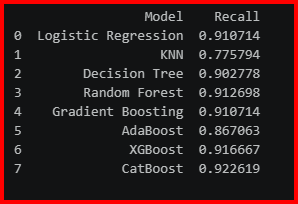

# 🎯 Lead Conversion Prediction using Machine Learning

## 📌 Project Overview

This project aims to predict whether a lead will convert into a paying customer for **X Education** using Machine Learning classification algorithms. The objective is to identify high-potential leads and help the sales team prioritize them effectively.

The project includes data preprocessing, feature engineering, model building, model evaluation, and prediction on unseen test data.

---

## 📖 Problem Statement

X Education generates leads from various sources such as websites, search engines, referrals, and advertisements. However, only a small percentage of these leads convert into customers.

The goal of this project is to build machine learning models that predict whether a lead will convert (`Converted = 1`) or not (`Converted = 0`).

The best model is selected based on the **Recall Score**, as required by the project.

---

## 📂 Dataset

The project contains  files:

- **train.csv** – Training dataset containing input features and the target variable (`Converted`)
- **test.csv** – Test dataset without the target variable


### Target Variable

| Value | Meaning |
|-------|---------|
| 1 | Converted |
| 0 | Not Converted |

---

# 🛠️ Project Workflow

```
Load Data
        │
        ▼
Exploratory Data Analysis (EDA)
        │
        ▼
Data Cleaning
        │
        ▼
Missing Value Treatment
        │
        ▼
Feature Encoding
        │
        ▼
Train-Test Split
        │
        ▼
Feature Scaling (Required Models)
        │
        ▼
Model Building
        │
        ▼
Model Evaluation
        │
        ▼
Model Comparison
        │
        ▼
Best Model Selection
        │
        ▼
Prediction on Test Data
        │
        ▼
submission.csv
```

---

# 📊 Exploratory Data Analysis (EDA)

- Dataset Information
- Missing Value Analysis
- Duplicate Value Analysis
- Constant Column Detection
- Categorical Feature Analysis
- Numerical Feature Analysis
- Data Distribution
- Correlation Analysis

---

# 🧹 Data Preprocessing

The following preprocessing techniques were applied:

### Missing Value Treatment

- Numerical Features → Median Imputation
- Categorical Features → Mode Imputation

### Removed Columns

- Identifier Columns
- Constant Columns

### Feature Encoding

- Binary Encoding
- Ordinal Encoding
- One-Hot Encoding

### Feature Alignment

```python
X, test = X.align(test, join="left", axis=1, fill_value=0)
```

This ensures that both training and test datasets have identical columns.

---

# ✂️ Train-Test Split

The training dataset was divided into:

- **80% Training Data**
- **20% Validation Data**

```python
X_train, X_valid, y_train, y_valid = train_test_split(
    X,
    y,
    test_size=0.2,
    random_state=42
)
```

---

# ⚖️ Feature Scaling

Feature scaling was applied only to algorithms that require it.

| Model | Scaling |
|--------|----------|
| Logistic Regression | ✅ Yes |
| KNN | ✅ Yes |
| Decision Tree | ❌ No |
| Random Forest | ❌ No |
| Gradient Boosting | ❌ No |
| AdaBoost | ❌ No |
| XGBoost | ❌ No |
| CatBoost | ❌ No |

Scaling Method:

```python
StandardScaler()
```

---

# 🤖 Machine Learning Models

The following classification models were implemented:

- Logistic Regression
- K-Nearest Neighbors (KNN)
- Decision Tree
- Random Forest
- Gradient Boosting
- AdaBoost
- XGBoost
- CatBoost

---

# 📈 Evaluation Metrics

The following metrics were used to evaluate the models:

- Accuracy
- Precision
- Recall
- F1 Score
- Confusion Matrix

### Primary Evaluation Metric

✅ **Recall Score**

The model with the highest Recall Score was selected as the final model.

---

# 🏆 Model Comparison


---

# 🎯 Final Model

The final model was selected based on the highest Recall Score.

The trained model was used to predict the target values for the **test dataset**.

---

# 📤 Submission File

The final prediction file was generated in the following format:

```text
ID,Converted
8305,0
1591,1
8604,1
```

The submission file was saved as:

```
submission.csv
```

---

# 🛠️ Technologies Used

- Python
- Pandas
- NumPy
- Scikit-learn
- XGBoost
- CatBoost
- Matplotlib
- Jupyter Notebook
- Visual Studio Code

---

# 📁 Project Structure

```
Lead-Conversion-Prediction/
│
├── train.csv
├── test.csv
├── Lead_Conversion_Prediction.ipynb
├── submission.csv
├── README.md

```

---


# 👩‍💻 Author

**Alakananda P**

